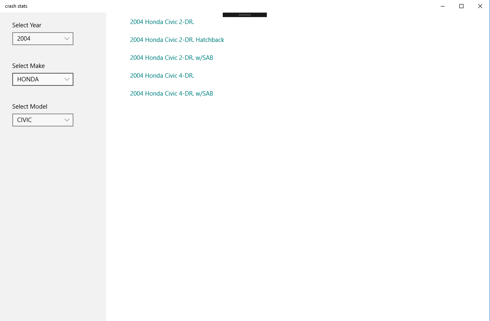
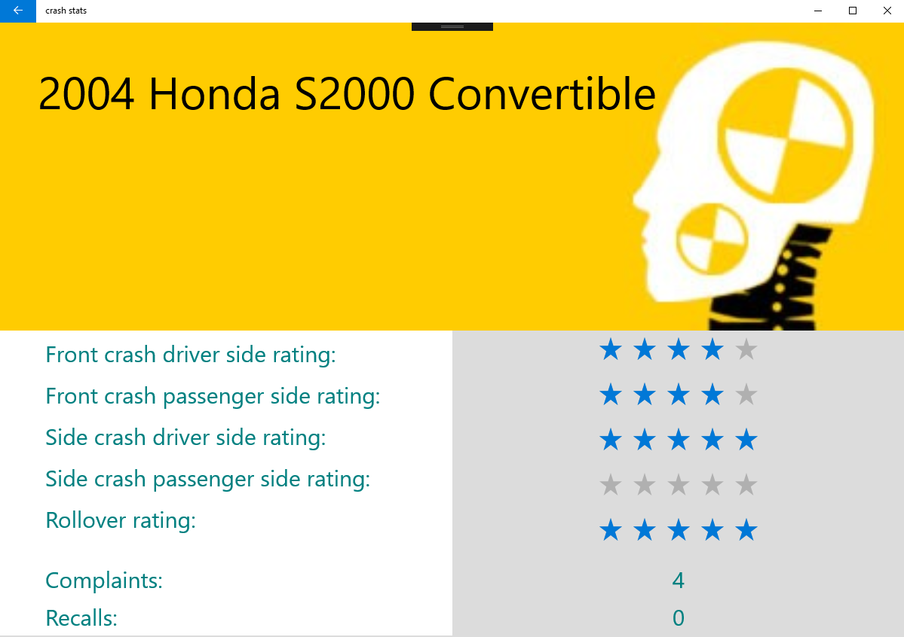

# vehicle-stats

## Crash Stats App

## Synopsis

Display vehicle test crash info from NHTSA API

## Screenshots





## Getting Started

Visual Studio 2017 is needed to run.
Windows store link: https://www.microsoft.com/store/apps/9NR33FCLQW33

You must clone the repository using:
```
git clone https://github.com/sshhane/vehicle-stats
```

Navigate into folder:
```
cd vehicle-stats
```
Run using visual studio 2017

## Using the app

To get the crash test results you must first choose a year, make and model from the left side.  Next you must select the variant from the list on the right.  You will then navigate to the results page.  To find another vehicles results you can press the back button on the top left corner and search again.
